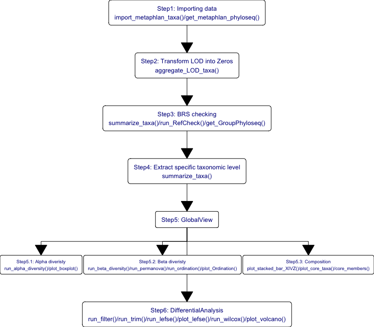

<!-- README.md is generated from README.Rmd. Please edit that file -->

# Metagenomic Microbiota Data Analysis based on XMAS2 package

## :book: Procedures

The standard data analysis of 16S and MGS data by **XMAS 2.0**. The
upstream process is performed by in-house pipeline. and this example
just shows how to perform downstream data analysis. In briefly, the
example comprises the following steps:

1.  Converting inputs into phyloseq object;

2.  Quality Evaluation;

3.  Pre-Processing Data;

4.  Diversity analysis;

5.  Ordination analysis;

6.  Composition analysis;

7.  Differential analysis;

8.  Network analysis.

## :writing_hand: Authors

1.  [Hua Zou](zouhua@xbiome.com)

Xbiome company

## :wrench: Change log

-   Submitted to gitlab. (2022-05-28)
-   upload *bookdwon*. (2022-08-04)
-   add Chapter *Network Analysis* . (2022-08-04)
